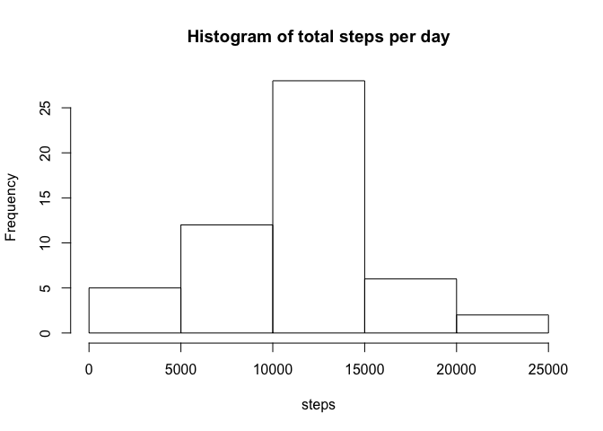
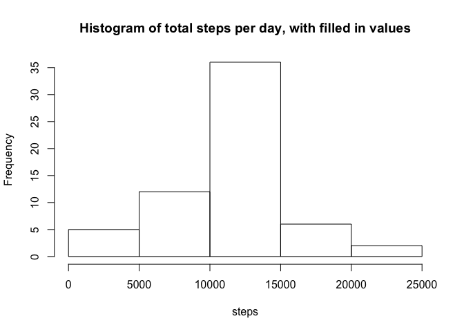
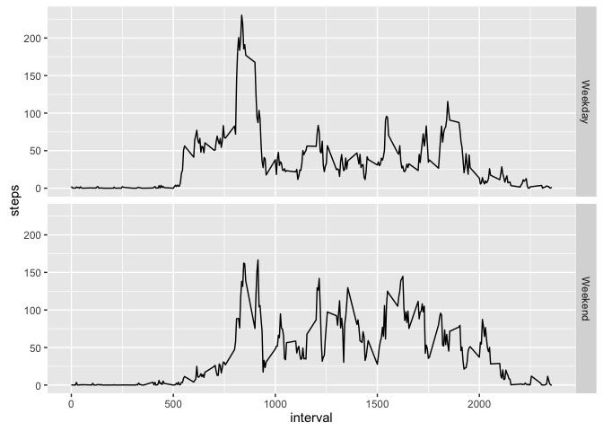

# Reproducible Research: Peer Assessment 1


## Loading and preprocessing the data
To load and process the data I used the code below

```r
unzip("activity.zip")
activity <- read.csv("activity.csv")
by_day <- aggregate(activity$steps, by=list(activity$date), FUN = sum)
names(by_day) <- c("date", "steps")
by_interval <- aggregate(activity$steps, by=list(activity$interval), FUN = mean, na.rm=T)
names(by_interval) <- c("interval", "steps")
```

## What is mean total number of steps taken per day?

```r
hist(by_day$steps, main = "Histogram of total steps per day", xlab = "steps")
```


The mean steps per day is 1.0766189\times 10^{4} and the median steps per day is 10765.

```r
mean(by_day$steps, na.rm=T)
```

```
## [1] 10766.19
```

```r
median(by_day$steps, na.rm=T)
```

```
## [1] 10765
```

## What is the average daily activity pattern?

```r
plot(by_interval$interval, by_interval$steps, type = "l", xlab = "interval", ylab = "steps")
```


The interval with the largest number of steps is 835.

```r
by_interval[order(-by_interval$steps)[1],1]
```

```
## [1] 835
```

## Imputing missing values
There are a total of 2304 missing values in the dataset. 

```r
sum(is.na(activity$steps))
```

```
## [1] 2304
```
To fill this in I will use the mean for that interval across all the days we have data for.

```r
missing <- activity[is.na(activity$steps),]
ready <- activity[!is.na(activity$steps),]

for (i in 1:length(missing$steps)) {
  missing$steps[i] <- by_interval[by_interval$interval == missing$interval[i],2]}

new_activity <- rbind(ready, missing)

new_by_day <- aggregate(new_activity$steps, by=list(new_activity$date), FUN = sum)
names(new_by_day) <- c("date", "steps")

hist(new_by_day$steps, main = "Histogram of total steps per day, with filled in values", xlab = "steps")
```


Following filling in the missing values the new mean is 1.0766189\times 10^{4} and the new median is 1.0766189\times 10^{4}

```r
mean(new_by_day$steps)
```

```
## [1] 10766.19
```

```r
median(new_by_day$steps)
```

```
## [1] 10766.19
```
## Are there differences in activity patterns between weekdays and weekends?

To extract the weekday information I used the following code:

```r
new_activity$weekday <- weekdays(as.Date(new_activity$date))
new_activity$weekday[new_activity$weekday == "Saturday" | new_activity$weekday == "Sunday"] <- "Weekend"
new_activity$weekday[!new_activity$weekday == "Weekend"] <- "Weekday"


new_activity <- aggregate(new_activity$steps, by=list(new_activity$interval, new_activity$weekday), FUN = mean)
names(new_activity) <- c("interval", "weekday", "steps")

library(ggplot2)
qplot(interval, steps, data = new_activity, geom = "line", facets = weekday ~ .)
```


